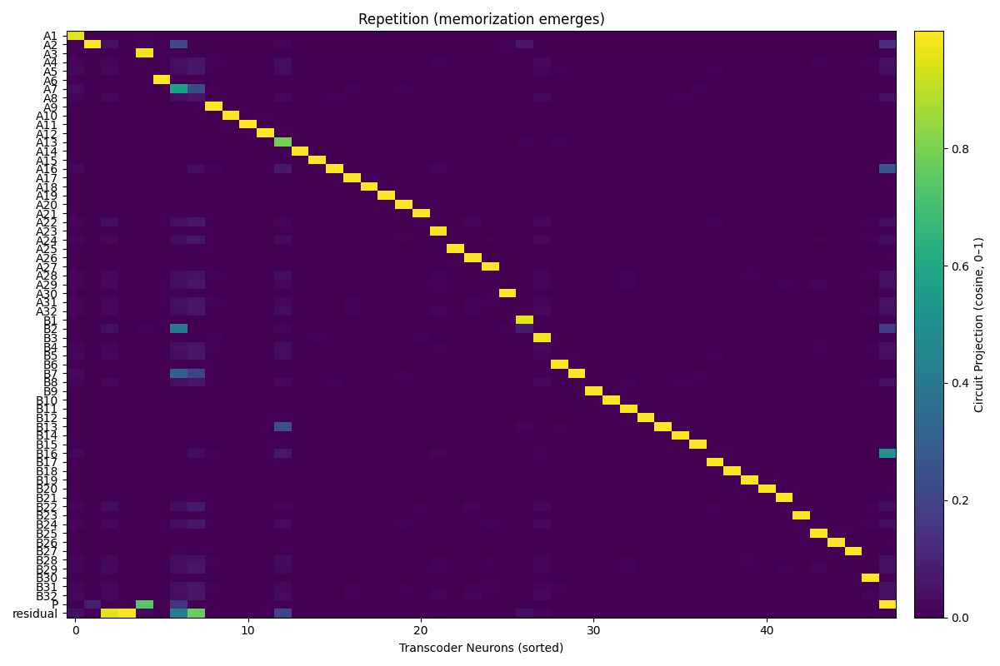
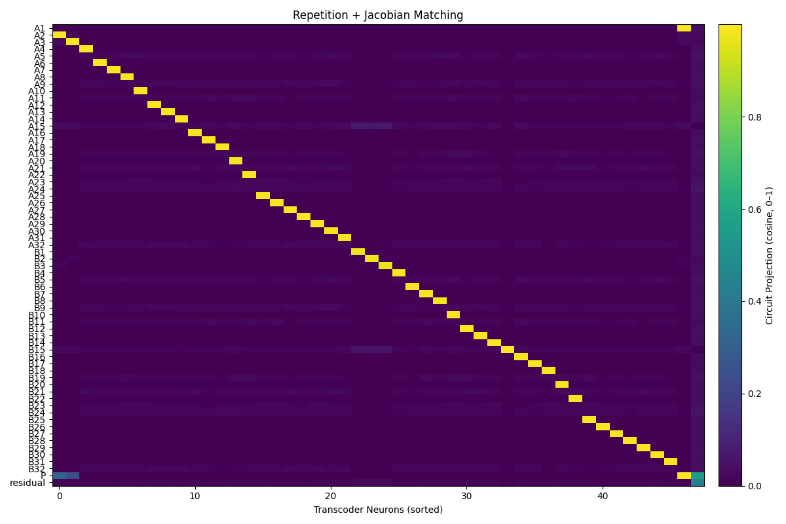

# toy-mechanistic-unfaithfulness-reproduce
Code and experiments reproducing A Toy Model of Mechanistic Unfaithfulness. Includes toy setups to analyze how mechanistic interpretability can produce unfaithful explanations and insights for model reasoning.

| Baseline | Repetition | Repetition  + Jacobian |
|---|---|---|
|  |  |  |  

|Metric | Baseline | Repetition | Repetition  + Jacobian |
|----|---|---|---|
|Validation Loss | 0.02354 |  0.02370  | 0.02232   |
|Sparsity | 0.52182 |  0.43078  | 0.40462   |

# A Toy Model of Mechanistic (Un)Faithfulness

## 1. Background  

This experiment begins with the question: **If a model produces the same output, can we guarantee that its internal computations are identical to the original model?**  

To investigate, we use a simple **coordinate-wise absolute value (ABS)** task.  
- Input vector **x** ∈ ℝᵈ, with each coordinate sampled from a uniform distribution in [-1, 1].  
- The goal is to compute |x| coordinate-wise.  

A one-layer ReLU network can compute this exactly with **two features per coordinate** (positive and negative regions). Thus, the full mechanism requires **2 × d features**.

---

## 2. Expected Behavior of a Faithful Transcoder  
A *Faithful Transcoder* is designed to replicate the **neuron activation patterns** of the original ABS network.  
- Ideally: it learns the same **2 × d features**, each tied to a single coordinate and sign region.  
- However: **identical output does not imply identical mechanisms.**  
  - During optimization, the Transcoder may find a cheaper path, adopting **shortcut mechanisms**.

---

## 3. Experiment with Repeated Data Points  
To test this, we modify the dataset by fixing ~5% of training inputs to a single vector **p = [1, 1, 1, 0, 0, …]**.  

- The ABS model still applies the rule |p| = p without special treatment.  
- But the Transcoder, when combined with **L1 sparsity regularization**, creates a **datapoint feature** — a neuron that activates only when the input ≈ p.  
- As a result, original independent features like `ReLU(x₁)`, `ReLU(x₂)`, `ReLU(x₃)` disappear, replaced by this shortcut.

---

## 4. Why Mechanistic Faithfulness Breaks  
Shortcut features cause:  
- **Loss perspective**: training accuracy remains high, as p is handled correctly.  
- **Mechanism perspective**: introduces *new datapoint-specific pathways*.  
- **Generalization perspective**: behavior diverges from the original model when inputs deviate slightly from p.  

This is a classic case of **mechanistic unfaithfulness**: same outputs, different internal reasoning.

---

## 5. Solution – Jacobian Regularization  
True mechanistic faithfulness requires not just matching **outputs**, but also matching **influence patterns** — how each input dimension affects outputs.  

- This influence is quantified by the **Jacobian matrix**.  
  - Ground-truth ABS model: near-diagonal Jacobian (each input only affects its output).  
  - Transcoder with datapoint feature: strong **off-diagonal terms** appear.  

**Jacobian Matching Loss** forces the Transcoder’s Jacobian closer to the original, discouraging shortcuts.  
- Efficient variant: match **Jacobian-vector products (Jv)** instead of full Jacobians.

---

## 6. Key Takeaways  
1. **Same output ≠ Same mechanism** – Transcoders may exploit shortcuts.  
2. **Repeated data points + sparsity** encourage shortcut features.  
3. **Jacobian regularization** preserves original mechanisms by aligning influence patterns.  

---

## Reference  
- [Transformer Circuits: A Toy Model of Mechanistic (Un)Faithfulness](https://transformer-circuits.pub/2025/faithfulness-toy-model/index.html)
